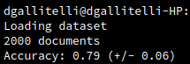
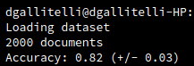
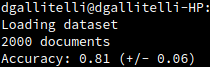

# [SD-TSIA214] TP 2 - Sentiment Analysis

- Davide GALLITELLI
- Carlotta CASTELLUCCIO

### Discussion about the implementation
During this tp, we implemented a Naive Bayes classifier, able to do "sentiment analysis", labelling movie reviews as positive or negative. The dataset is composed by 2000 documents of reviews, the second half of which was used for training and the first half for testing.

The function **count_words** is the one which builds the vocabulary. The first loop of this function is used to fill the **words** set, containing all the words of all the documents (without the stop words), without repetitions. From this set, we build the **vocabulary**, as a dictionary having an incremental index (the position) as key and the word as value. The other data structure created and returned by this function is the matrix **counts**, of size n_documents x n_features (=n_words): each cell i,j contains the frequency of a term in the document i at the position j of the vocabulary. 

After running the count_words function, our algorithm trains the model, using the **fit** function: the aim of this function is to compute the probability of each class c (in our case only neg and pos), as n_documents_labelled_as_c/n_training_documents and the probability of term t conditioned to c (for each term in the training set and for each c), that means the probability of term t to be in a document labelled as c. For storing all these conditioned probabilities we created the dictionary tct, having as key the class c and as value the sum of the frequencies previously computed and inserted into counts, but considering only the frequencies in document of class c. Finally the dictionary condprob is built over tct, by adding to each cell the Laplacian smoothing, allowing the attribution of non-zero probabilities to words not contained in the learning set. 

The prediction is done by the **predict** function, that fills the **score** matrix, whose size is n_testing_documents x n_classes. Each cell score[x][c] is initialized as the log of the probability of class c, for each documents x of the testing set. Then, to each cell score[x][c] and for each term t, appearing in the document x, we added the conditioned probability of t given c, previously computed, in order to obtain the total probabilities for the document x of being neg or pos, and choosing the label with the highest one. The result returned by this function is  actually the array containing the predicted labels for each document.

### Question 2 
Movie reviews are labelled as **positive** if they have at least a rating of three-and-a-half stars out of five, or at least three stars out of four or a grade equal or greater than B. On the contrary, they are labelled as **negative** if they have a rating of two stars or below out of five, or one-and-a-half stars or below out of four, or a grade equal or lower than C. 

### Question 4 
Accuracy obtained with **our custom classifier**, using cross validation 5-folds:

### Question 5
The performances of our model doesn't change in terms of accuracy using the preprocessing function that filter the stopwords (contained in the english.stop file). However, we noticed an improvement in terms of computational time (because the vocabulary is reduced, before being processed by our model). 

### SCIKIT-LEARN USE

### Question 1 - Scikit-Learn compare
Accuracy obtained with **Scikit MultinomialNB classifier**:

Our custom classifier has better performances, although slower in running. Standard deviation is generally better too.

### Question 2 - Testing another classifier
We compared our model with **Scikit Logistic Regression classifier**.
The accuracy obtained is slightly better, as shown by the following screen:

### Question 3 - NLTK Stemming

Stemming the words does not seem to improve the accuracy of our classifier, just speeding it up a little bit since there are less words to check in the vocabulary.

### Question 4 - Stemming + POS_TAG
The last test is applying a filter to select only some categories of words (nouns, verbs, adverbs and adjectives) on the stemmed vocabulary. The accuracy in this case is slightly lower, data that can be explained by the fact that some meaningful words for the classification are removed during the preprocessing phase.

